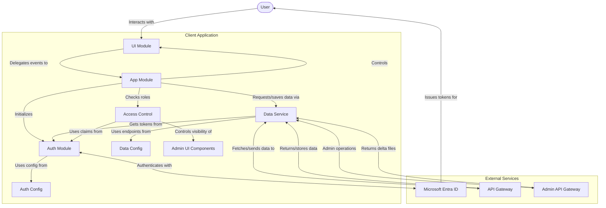
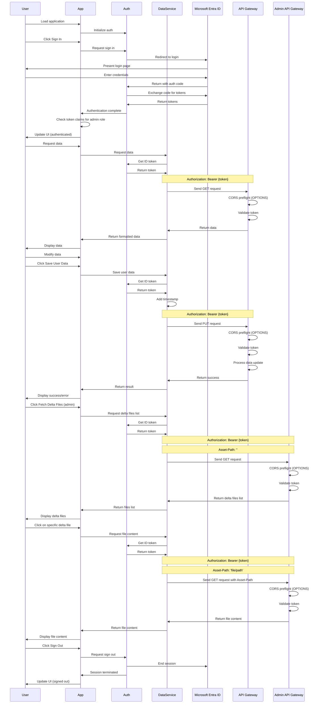
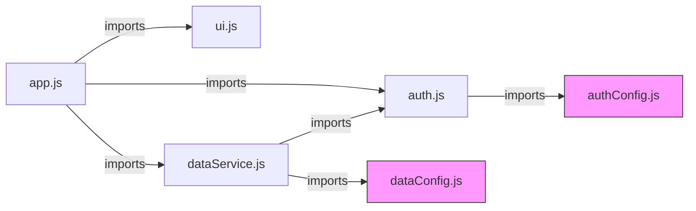

# Cloud Survey Application Architecture

This document outlines the technical architecture and flow of the Cloud Survey Application. The application is built as a modular client-side JavaScript application that authenticates users with Microsoft Entra ID, provides dynamic survey question rendering, and persists responses through secure APIs.

## Overall Architecture

The application follows a modular architecture with clear separation of concerns:

- The core application logic coordinates authentication flow and survey initialization
- Authentication is handled through Microsoft Entra ID (Azure AD) using MSAL.js
- Survey rendering modules handle different question types through specialized renderers
- Data services manage API communication with authentication tokens, including both survey retrieval and response persistence
- UI components handle rendering and user interactions with bidirectional data flow
- Survey data follows a structured JSON schema for consistent handling of questions and responses
- Admin module provides specialized functionality for authenticated administrators

## Module Structure

The application is structured into several key JavaScript modules:

| Module | Responsibility |
|--------|----------------|
| `app.js` | Main application coordinator that initializes components and manages survey flow |
| `auth.js` | Handles authentication with Microsoft Entra ID using MSAL.js |
| `authConfig.js` | Configuration parameters for Microsoft authentication |
| `dataService.js` | Manages authenticated API calls, data caching, and administrative operations |
| `dataConfig.js` | Configuration for API endpoints including admin endpoints |
| `surveyData.js` | Manages survey data, responses, and persistence |
| `ui.js` | Handles DOM manipulation and user interface interactions including admin UI |
| `questionRenderers.js` | Base question rendering module for standard question types |
| `questionRenderersExtended.js` | Specialized renderers for complex question types (Likert, Range, Matrix) |
| `questionRenderersRank.js` | Specialized renderers for ranking questions with drag-and-drop functionality |
| `questionRenderersTags.js` | Specialized renderers for tag-based selection questions |

## Survey Question Renderer Architecture

The survey application uses a modular approach to question rendering, with specialized renderer modules for different question types:

### Base Question Rendering (questionRenderers.js)

- **Core Functionality**: Provides the foundation for rendering all question types
- **Supported Question Types**:
  - Short Text: Single-line text input fields
  - Long Text: Rich text editors with formatting capabilities
  - Radio: Single-select option lists with "Other" field support
  - Checkbox: Multi-select option lists with "Other" field support
  - Multi-Value Slider: Positioning multiple options along a horizontal scale with dedicated vertical lanes
- **Common Components**:
  - Question container creation
  - Comment field support
  - Response saving integration

### Extended Question Types (questionRenderersExtended.js)

- **Likert Scale Questions**: Multi-item rating scales with configurable range
  - Support for custom range definitions (1-5, 1-7, etc.)
  - Custom labels for scale points
  - Matrix presentation for evaluating multiple items on the same scale
- **Range Slider Questions**: Interactive sliders for selecting values within a range
  - Configurable min/max values
  - Step value control
  - Custom tick marks and labels
- **2D Matrix Questions**: Two-dimensional grid selection
  - Configurable rows and columns
  - Single or multi-select modes

### Multi-Value Slider Questions (questionRenderersMultiValueSliderD3.js)

- **Core Functionality**: Allows positioning multiple options along a horizontal scale
- **Key Features**:
  - SVG-based implementation using D3.js for smooth interactions and scalability
  - Dynamic support for many options (10-12+) with automatic vertical distribution
  - Two operational modes: discrete zones and continuous range
  - Support for different marker shapes (circle, rectangle, triangle)
  - Option identification with capital letters and hover tooltips
  - Legend mapping letters to full option labels
  - Drag-and-drop positioning with snapping to zones in discrete mode
- **D3.js Architecture**:
  - Responsive SVG container that adapts to screen size
  - Dynamic scaling with D3.js scale functions
  - Declarative data binding between option data and visual elements
  - Smooth transitions and visual feedback during interactions
  - Equal vertical distribution of options for optimal spacing
- **Implementation Details**:
  - Zones with configurable colors and labels in discrete mode
  - Color gradient using SVG linear gradients in continuous mode
  - D3.js drag behavior for smooth and precise positioning
  - Position values saved as percentages (0-100) for each option
  - Response format structured as mapping between option IDs and positions
  - ResizeObserver for responsive layout adaptation

### Ranking Question Rendering (questionRenderersRank.js)

- **Functionality**: Drag-and-drop interfaces for ranking options
- **Features**:
  - Sortable item lists
  - Visual feedback during sorting
  - Scale indicators for priority levels

### Tag Question Rendering (questionRenderersTags.js)

- **Functionality**: Tag selection and creation interface
- **Features**:
  - Predefined tag selection
  - Custom tag creation
  - Interactive tag management
  - Tag filtering and suggestions

### Dependencies and Component Relationships

- **Module Dependencies**:
  - All renderer modules depend on surveyData.js for response management
  - Extended renderers reference base renderer patterns
  - Each module exports specific renderer functions that are imported where needed

- **Component Hierarchy**:
  ```
  questionRenderers.js
  ├── Core container creation
  ├── Basic question types
  └── Imported by:
      ├── app.js (main coordination)
      ├── questionRenderersExtended.js (extends patterns)
      ├── questionRenderersRank.js (uses container patterns)
      └── questionRenderersTags.js (uses container patterns)
  ```

## Survey Data Structure

Survey data follows a structured JSON schema:

- **Survey**: Top-level object with title, description and steps
- **Steps**: Logical groupings of related questions with navigation between them
- **Questions**: Individual survey questions with various properties:
  - Common properties: id, type, title, description, required flag
  - Type-specific properties: options, configuration parameters
  - Specialized configuration for complex question types

### Data Flow for Survey Responses

1. Survey definition loaded from JSON source
2. Questions rendered based on their type using appropriate renderer
3. User interactions captured through event listeners
4. Responses saved to surveyData.js in-memory store
5. On completion, responses sent to server via authenticated API calls

## Application Flow

1. **Initialization**:
   - The application starts when the DOM is loaded
   - The app checks if MSAL.js is available and loads it if not
   - Auth module is initialized with configuration from authConfig.js
   - Survey configuration and question definitions are loaded from JSON sources

2. **Authentication Flow**:
   - On first load, the app checks for existing authentication or handles redirect from auth provider
   - User can click "Sign In" to begin authentication with Microsoft Entra ID
   - Auth module redirects to Microsoft login page
   - After successful login, Microsoft redirects back to the application
   - MSAL.js handles the token acquisition and storage
   - User information is fetched from Microsoft Graph API

3. **Survey Loading & Navigation Flow**:
   - After authentication, survey definition is loaded from configured API endpoint
   - Survey metadata (title, description) is displayed to the user
   - The first step of the survey is rendered
   - Question renderers are dynamically selected based on question types
   - Navigation controls allow moving between survey steps
   - Progress indicators show completion status
   - Survey state is maintained during navigation

4. **Question Rendering Process**:
   - For each question in the current step:
     - Type-specific renderer is selected (e.g., renderRadio, renderLikert, renderTagsQuestion)
     - Question container and title elements are created
     - Type-specific input elements are generated
     - Existing responses are loaded if available
     - Event listeners are attached for user interaction
     - Comment fields are added if enabled for the question
   - Common functions like createQuestionContainer and createCommentField are reused across renderers

5. **Data Persistence Flow**:
   - User interactions with question inputs trigger response saving
   - Responses are stored in memory via surveyData.js
   - When moving between steps, responses are validated if required
   - On survey completion, all responses are compiled
   - The ID token from authentication is used as a bearer token
   - Complete response data is sent to the server via authenticated PUT requests
   - Responses are timestamped with lastModified property

6. **Component Interaction**:
   - App module coordinates between auth, surveyData, and UI modules
   - Question renderers handle specific question type rendering
   - SurveyData module maintains response state and persistence
   - UI module responds to user interactions and delegates to app module
   - Auth module maintains authentication state and tokens
   - Data service module handles API communication, caching, and data persistence
   - Bidirectional data flow allows both reading and writing survey data
   - Role-based access control determines availability of admin functionality

## Security Considerations

- Tokens are stored in memory only, not persisted to localStorage or cookies
- API calls include proper authorization headers using bearer tokens
- Authentication uses industry-standard OAuth 2.0 and OpenID Connect protocols
- CORS preflight requests are automatically handled by the browser for authenticated API calls

## Technical Details

### Authentication Flow

The authentication uses the OAuth 2.0 authorization code flow with PKCE, implemented through MSAL.js:

1. App initializes MSAL with configuration
2. User triggers sign-in, which redirects to Microsoft Entra ID
3. User authenticates on Microsoft's login page
4. Authorization code is returned to the app
5. MSAL exchanges the code for tokens
6. Tokens are stored in memory
7. ID token is used to display user information
8. Access token is used for API calls

### API Communication

The application communicates with backend APIs using the following patterns:

**Data Retrieval (GET):**
1. Retrieves the ID token from the auth module
2. Constructs a fetch request with the token in the Authorization header
3. Sends the GET request to the configured endpoint
4. Handles the response, including error cases
5. Caches the successful response for future use
6. Updates the UI with the retrieved data

**Data Persistence (PUT):**
1. Captures modified data from the UI
2. Validates data format (JSON parsing)
3. Adds metadata such as lastModified timestamp
4. Retrieves the ID token from the auth module
5. Constructs a fetch request with the token in the Authorization header
6. Sends the PUT request to the configured endpoint with the data payload
7. Handles the response, including success and error cases
8. Updates the UI with status information

**Admin Operations:**
1. Validates user has appropriate access rights
2. Retrieves the ID token from the auth module
3. Constructs a fetch request with the token in the Authorization header
4. For file listings, sends a GET request with an empty Asset-Path header
5. For specific file content, sends a GET request with the specific Asset-Path
6. Handles response data and updates the admin UI section
7. Provides interactive file browsing through dynamically created elements

### Admin Access Control

The application implements role-based access control for administrative functions:

1. **Authentication Verification**: Admin functionality is only available to authenticated users
2. **Role-Based Access**: The system checks ID token claims for specific roles
3. **UI Visibility Control**: Admin UI components are conditionally displayed based on authorization
4. **Secure API Calls**: All admin API calls include proper authorization headers
5. **Custom Headers**: Specific Asset-Path headers are added to target admin operations

## Component Diagram



## Data Flow Diagram



## Module Dependencies



## Environment Requirements

The application is designed to run in any modern web browser with JavaScript enabled. It requires:

1. Network connectivity to Microsoft authentication services
2. Network connectivity to the configured API endpoints
3. Support for modern JavaScript features (ES6+)
4. CORS support for cross-origin API requests

## Development Principles

This project follows these development principles:

1. **Modular Code**: Uses ES Modules to break up functionality into logical units
2. **Size Limitations**: JavaScript files are kept under 200 lines for maintainability
3. **No Magic Values**: Constants are used instead of hardcoded values
4. **Documentation**: Comprehensive comments explain what the code does


## Configuration OCI API Gateway
This application interacts with an OCI API Gateway that does token validation and forwards the request to the configured backend - JSON files on OCI Object Storage (accessible via Pre Authenticated Request). Two deployments are used
* regular - for read only access to main data file and user specific delta file and to create/update the user specific delta file
* admin - for read access to all delta files and write access to main data file and user specific delta files

  oci api-gateway deployment get   --deployment-id ocid1.apideployment.oc1.eu-amsterdam-1.amaaaaaaq3px4vqaee2etqfmv4vkivhoakaw3zdm2y5beoaqz24dpnxx6moa   --query "data.specification"   --raw-output > deployment-spec.json


### Deployment specification for non-admin API gateway:

As described in article [No Code challenge: create file named after user in OCI Bucket through OCI API Gateway](https://medium.com/@lucasjellema/no-code-challenge-create-file-named-after-user-in-oci-bucket-through-oci-api-gateway-646270ab3b33)
```
{
  "logging-policies": {
    "access-log": null,
    "execution-log": {
      "is-enabled": null,
      "log-level": "INFO"
    }
  },
  "request-policies": {
    "authentication": {
      "audiences": [
        "c0461816-7078-466b-9329-6be5824c82dd"
      ],
      "is-anonymous-access-allowed": false,
      "issuers": [
        "https://login.microsoftonline.com/21429da9-e4ad-45f9-9a6f-cd126a64274b/v2.0"
      ],
      "max-clock-skew-in-seconds": null,
      "public-keys": {
        "is-ssl-verify-disabled": null,
        "max-cache-duration-in-hours": 1,
        "type": "REMOTE_JWKS",
        "uri": "https://login.microsoftonline.com/21429da9-e4ad-45f9-9a6f-cd126a64274b/discovery/v2.0/keys"
      },
      "token-auth-scheme": "Bearer",
      "token-header": "Authorization",
      "token-query-param": null,
      "type": "JWT_AUTHENTICATION",
      "verify-claims": null
    },
    "cors": {
      "allowed-headers": [
        "Authorization",
        "Content-Type"
      ],
      "allowed-methods": [
        "*"
      ],
      "allowed-origins": [
        "http://localhost:5501",
        "https://lucasjellema.github.io"
      ],
      "exposed-headers": [],
      "is-allow-credentials-enabled": true,
      "max-age-in-seconds": 1000
    },
    "dynamic-authentication": null,
    "mutual-tls": {
      "allowed-sans": [],
      "is-verified-certificate-required": false
    },
    "rate-limiting": null,
    "usage-plans": null
  },
  "routes": [
    {
      "backend": {
        "connect-timeout-in-seconds": 60.0,
        "is-ssl-verify-disabled": false,
        "read-timeout-in-seconds": 10.0,
        "send-timeout-in-seconds": 10.0,
        "type": "HTTP_BACKEND",
        "url": "https://idf2hanz.objectstorage.us-ashburn-1.oci.customer-oci.com/p/G8wAK_uS-uBdSUWKsX8/n/2hanz/b/laptop-extension-drive/o/conclusion-assets/Sprekerpool.json"
      },
      "logging-policies": {
        "access-log": null,
        "execution-log": {
          "is-enabled": null,
          "log-level": "INFO"
        }
      },
      "methods": [
        "GET",
        "HEAD",
        "OPTIONS"
      ],
      "path": "/speakerpool-data",
      "request-policies": {
        "authorization": {
          "type": "AUTHENTICATION_ONLY"
        },
        "body-validation": null,
        "cors": null,
        "header-transformations": null,
        "header-validations": null,
        "query-parameter-transformations": null,
        "query-parameter-validations": null,
        "response-cache-lookup": null
      },
      "response-policies": {
        "header-transformations": null,
        "response-cache-store": null
      }
    },
    {
      "backend": {
        "connect-timeout-in-seconds": 60.0,
        "is-ssl-verify-disabled": false,
        "read-timeout-in-seconds": 10.0,
        "send-timeout-in-seconds": 10.0,
        "type": "HTTP_BACKEND",
        "url": "https://f2hanz.objectstorage.us-ashburn-1.oci.customer-oci.com/p/1EJ9RMVL5l5EQnFCI_V9b5/n/f2hanz/b/laptop-extension-drive/o/conclusion-assets/deltas/${request.auth[name]}"
      },
      "logging-policies": {
        "access-log": null,
        "execution-log": {
          "is-enabled": null,
          "log-level": "INFO"
        }
      },
      "methods": [
        "GET",
        "POST",
        "HEAD",
        "OPTIONS",
        "PUT"
      ],
      "path": "/speakerpool-delta",
      "request-policies": {
        "authorization": {
          "type": "AUTHENTICATION_ONLY"
        },
        "body-validation": null,
        "cors": null,
        "header-transformations": null,
        "header-validations": null,
        "query-parameter-transformations": null,
        "query-parameter-validations": null,
        "response-cache-lookup": null
      },
      "response-policies": {
        "header-transformations": null,
        "response-cache-store": null
      }
    }
  ]
}
```
  

  ### Deployment specification for admin API gateway:


  
	```
{
  "logging-policies": {
    "access-log": null,
    "execution-log": {
      "is-enabled": null,
      "log-level": "INFO"
    }
  },
  "request-policies": {
    "authentication": {
      "audiences": [
        "c0461816-7078-466b-9329-6be5824c82dd"
      ],
      "is-anonymous-access-allowed": false,
      "issuers": [
        "https://login.microsoftonline.com/21429da9-e4ad-45f9-9a6f-cd126a64274b/v2.0"
      ],
      "max-clock-skew-in-seconds": null,
      "public-keys": {
        "is-ssl-verify-disabled": null,
        "max-cache-duration-in-hours": 1,
        "type": "REMOTE_JWKS",
        "uri": "https://login.microsoftonline.com/21429da9-e4ad-45f9-9a6f-cd126a64274b/discovery/v2.0/keys"
      },
      "token-auth-scheme": "Bearer",
      "token-header": "Authorization",
      "token-query-param": null,
      "type": "JWT_AUTHENTICATION",
      "verify-claims": [
        {
          "is-required": true,
          "key": "preferred_username",
          "values": [
            "Lucas.Jellema@amis.nl"
          ]
        }
      ]
    },
    "cors": {
      "allowed-headers": [
        "Authorization",
        "Content-Type",
        "Asset-Path"
      ],
      "allowed-methods": [
        "*"
      ],
      "allowed-origins": [
        "https://lucasjellema.github.io",
        "http://localhost:5501"
      ],
      "exposed-headers": [],
      "is-allow-credentials-enabled": true,
      "max-age-in-seconds": 0
    },
    "dynamic-authentication": null,
    "mutual-tls": {
      "allowed-sans": [],
      "is-verified-certificate-required": false
    },
    "rate-limiting": null,
    "usage-plans": null
  },
  "routes": [
    {
      "backend": {
        "connect-timeout-in-seconds": 60.0,
        "is-ssl-verify-disabled": false,
        "read-timeout-in-seconds": 10.0,
        "send-timeout-in-seconds": 10.0,
        "type": "HTTP_BACKEND",
        "url": "https://hanz.objectstorage.us-ashburn-1.oci.customer-oci.com/p/ggMwtR4/n/hanz/b/laptop-extension-drive/o/${request.headers[Asset-Path]}"
      },
      "logging-policies": {
        "access-log": null,
        "execution-log": {
          "is-enabled": null,
          "log-level": null
        }
      },
      "methods": [
        "ANY"
      ],
      "path": "/speakerpool-admin",
      "request-policies": {
        "authorization": {
          "type": "AUTHENTICATION_ONLY"
        },
        "body-validation": null,
        "cors": null,
        "header-transformations": null,
        "header-validations": null,
        "query-parameter-transformations": null,
        "query-parameter-validations": null,
        "response-cache-lookup": null
      },
      "response-policies": {
        "header-transformations": null,
        "response-cache-store": null
      }
    }
  ]
}	
	```
    